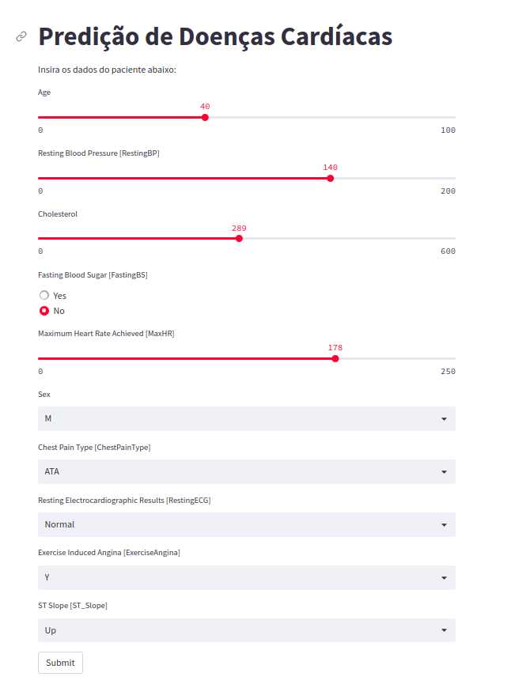

# API-for-Data-Science

Este projeto é um estudo de caso de machine learning com uma API construída com FastAPI e orientada a microserviço. A API permite aos usuários fazer previsões baseadas em dados de treinamento e fornecer resultados em tempo real. O objetivo é fornecer uma plataforma de fácil uso para aplicativos e sistemas que precisam de análise preditiva.




# Dados de previsão
    "ge": Número de anos de idade
    "sex": Gênero (0 = feminino, 1 = masculino)
    "chest_pain_type": Tipo de dor no peito (0-3)
    "resting_bp": Pressão arterial em repouso
    "cholesterol": Nível de colesterol
    "fasting_bs": Açúcar no sangue em jejum
    "resting_ecg": Resultado do ECG em repouso
    "max_hr": Batimentos cardíacos máximos durante o exercício
    "exercise_angina": Presença de angina durante o exercício (0 = não, 1 = sim)
    "oldpeak": Depressão do segmento ST
    "st_slope": Inclinação do segmento ST

# Para clonar e rodar o código, siga os seguintes passos:

1. Certifique-se de ter o Docker instalado em sua máquina. Você pode seguir as instruções de instalação disponíveis no site oficial: https://docs.docker.com/get-docker/

2. Clone o repositório do Github:
```bash
    git clone https://github.com/Gefte/API-for-Data-Science.git
```
3. Acesse o diretório do projeto:
```bash
    cd API-for-Data-Science
```
4. Execute o seguinte comando para construir as imagens dos containers:
```bash
    docker-compose build
```

5. Execute o comando abaixo para iniciar os contêineres:
```bash
    docker-compose up
```
6. Para acessar o aplicativo, clique no seguinte link em seu navegador:

   [http://172.24.0.3:8501](http://172.24.0.3:8501)

   Ou você pode copiar e colar o seguinte código em seu terminal:

    ```copy code
        http://172.24.0.3:8501
    ```

⚠️ **Certifique-se de que o Docker Compose esteja em execução enquanto você acessa o aplicativo no navegador.** ⚠️


# Estrutura do projeto
O projeto possui a seguinte estrutura de diretórios:

```bash
├── app
│   ├── backend
│   │   ├── Dockerfile
│   │   ├── main.py
│   │   ├── models
│   │   │   ├── encoder.pkl
│   │   │   ├── model.json
│   │   │   └── scaler.pkl
│   │   ├── __pycache__
│   │   │   ├── main.cpython-310.pyc
│   │   │   └── main.cpython-38.pyc
│   │   └── requirements.txt
│   └── frontend
│       ├── app.py
│       ├── Dockerfile
│       └── requirements.txt
├── docker-compose.yaml
├── models
│   ├── data_analise.ipynb
│   ├── heart.csv
│   └── pipeline_model.py
├── README.md
└── utils
    └── interface_app.png
```

# Os diretórios e arquivos mais importantes são:

* app/backend: contém o código do backend da aplicação.
* app/frontend: contém o código do frontend da aplicação.
* models: contém os arquivos necessários para treinar e executar o modelo de Machine Learning.
* docker-compose.yaml: arquivo que contém as configurações do Docker Compose para executar a aplicação.
* README.md: arquivo que contém as instruções de como executar o projeto.

# Tecnologias utilizadas
* Python
* FastApi
* Streamlit
* Docker


